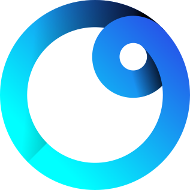

<p class="logo_title" align="center">
  
  mimas
</p>

<p align="justify">
mimas is a statically typed, embeddable scripting language for Rust. It carries over much of Rust's syntax and ergonomics, reshaping the rest to deliver what a scripting layer is good for: fast iteration, logic you can change without a rebuild, and a runtime that ships anywhere your program runs.
</p>

<p class="badges">
  <a href="https://github.com/imlazyeye/mimas"></a>
  <a href="https://crates.io/crates/mimas"></a>
  <a href="https://www.rust-lang.org"></a>
  <a href="https://github.com/imlazyeye/mimas#license"></a>
  <a href="https://github.com/imlazyeye/mimas/actions/workflows/test.yml"></a>
</p>

````admonish typed
**Static typing** with inference, **user-defined types**, exhaustive **pattern matching**, and more of the same features that empower you in Rust.
```mimas
let area: float? = match my_shape {
    Shape::Circle(r) => r * r * std::math::PI,
    Shape::Rectangle(w, h) => w * h,
    _ => null,
};
```
````

````admonish flexible
**Rigorous, not rigid.** Strong inference lets you focus on your goals, not your types. Writing is intuitive, and [sub-second](./introduction/benchmarks.md#compile-speed) compile times keep you in motion.
```mimas
let nums = [5, 3, 8, 1];
let big = for n in nums { if n > 4 collect n; };
print(f"found {big.len()}: {big}"); // -> found 2: [5, 8]
```
````

````admonish fast
**Stay fast.** Static analysis fuels the VM, putting mimas at the front of the pure-Rust scripting runtimes. [See the benchmarks for more](./introduction/benchmarks.md).

<!-- homepage benchmark start -->
<div class="bench"><h4><a href="https://github.com/imlazyeye/mimas/tree/main/benchmarks/physics">physics</a> <small>struct field access, float math</small></h4>
<table class="charts-css bar show-labels data-spacing-4"><tbody>
<tr><th scope="row">mimas</th><td class="me" style="--size:0.07320498533468472"><span class="data">928ms</span></td></tr>
<tr><th scope="row" class="long">fabricator</th><td style="--size:0.1810239681829396"><span class="data">2.29s</span></td></tr>
<tr><th scope="row">rune</th><td style="--size:0.22143650390777547"><span class="data">2.81s</span></td></tr>
<tr><th scope="row">boa</th><td style="--size:0.29603705921174783"><span class="data">3.75s</span></td></tr>
<tr><th scope="row">koto</th><td style="--size:0.4784179593076348"><span class="data">6.06s</span></td></tr>
<tr><th scope="row">steel</th><td style="--size:0.5178004998409025"><span class="data">6.56s</span></td></tr>
<tr><th scope="row">dyon</th><td style="--size:0.6601124304850979"><span class="data">8.37s</span></td></tr>
<tr><th scope="row" class="long">rustpython</th><td style="--size:0.8585265802171286"><span class="data">10.88s</span></td></tr>
<tr><th scope="row">rhai</th><td style="--size:1"><span class="data">12.68s</span></td></tr>
</tbody></table></div>
<p class="bench-legend">Pure-Rust runtimes, measured on an AMD Ryzen 7 9800X3D running Linux. <a href="https://github.com/imlazyeye/mimas">mimas</a> v0.1.0 · <a href="https://github.com/rhaiscript/rhai">Rhai (perf)</a> v1.26.0 · <a href="https://github.com/rune-rs/rune">Rune</a> v0.14.2 · <a href="https://github.com/koto-lang/koto">Koto</a> v0.16.1 · <a href="https://github.com/PistonDevelopers/dyon">Dyon</a> v0.51.2 · <a href="https://github.com/mattwparas/steel">Steel</a> v0.8.3 · <a href="https://github.com/boa-dev/boa">Boa</a> v0.22.0 · <a href="https://github.com/RustPython/RustPython">RustPython</a> v0.5.0 · <a href="https://github.com/kyren/fabricator">Fabricator</a> git cef73ca</p>
<!-- homepage benchmark end -->
````

````admonish extendable
**Share your Rust** types and functions with the `mimas` macro, all while **maintaining type safety**. The macro alone is all you need for mimas to find it.
```rust
// rust
#[mimas]
struct User(String);

#[mimas]
impl User {
    fn greet(self) {
        println!("Hello, {}!", self.0);
    }
}
```

```mimas
// mimas
let user = User("mimas");
user.greet(); // Hello, mimas!
```
````

```admonish robust
- **Guaranteed "Results"** -- mimas treats any panic as a bug, both in the compiler and the VM.
- **Tested top to bottom** -- over **1,700 tests** cover every corner of the codebase. Even the tests are tested, thanks to [cargo mutants](https://mutants.rs/).
- **Helpful diagnostics** -- bugs are caught at their source with clear reports powered by [miette](https://github.com/zkat/miette):

<pre class="diagnostic">  <span style="font-weight:bold;filter: contrast(70%) brightness(190%);color:red;">error: </span> <span style="font-weight:bold;filter: contrast(70%) brightness(190%);color:gray;">non-exhaustive match</span>
   ╭─[<span style="text-decoration:underline;color:teal;">tools/src/main.mim:3:1</span>]
 <span style="color:teal;">2</span> │     
 <span style="color:teal;">3</span> │ <span style="font-weight:bold;filter: contrast(70%) brightness(190%);color:olive;">╭</span><span style="font-weight:bold;filter: contrast(70%) brightness(190%);color:olive;">─</span><span style="font-weight:bold;filter: contrast(70%) brightness(190%);color:olive;">▶</span> match Color::random() {
 <span style="color:teal;">4</span> │ <span style="font-weight:bold;filter: contrast(70%) brightness(190%);color:olive;">│</span>       Color::Red =&gt; print(&quot;Red!&quot;),
 <span style="color:teal;">5</span> │ <span style="font-weight:bold;filter: contrast(70%) brightness(190%);color:olive;">│</span>       Color::Blue =&gt; print(&quot;Blue!&quot;),
 <span style="color:teal;">6</span> │ <span style="font-weight:bold;filter: contrast(70%) brightness(190%);color:olive;">├</span><span style="font-weight:bold;filter: contrast(70%) brightness(190%);color:olive;">─</span><span style="font-weight:bold;filter: contrast(70%) brightness(190%);color:olive;">▶</span> }
   · <span style="font-weight:bold;filter: contrast(70%) brightness(190%);color:olive;">╰</span><span style="font-weight:bold;filter: contrast(70%) brightness(190%);color:olive;">───</span><span style="font-weight:bold;filter: contrast(70%) brightness(190%);color:olive;">─</span> <span style="font-weight:bold;filter: contrast(70%) brightness(190%);color:olive;">missing pattern `Color::Green`</span>
 <span style="color:teal;">7</span> │     
   ╰────
<span style="font-weight:bold;filter: contrast(70%) brightness(190%);color:red;">  ╰─▶ </span>  <span style="font-weight:bold;filter: contrast(70%) brightness(190%);color:teal;">advice: </span> <span style="font-weight:bold;filter: contrast(70%) brightness(190%);color:gray;">`Color::Green` defined here</span>
<span style="font-weight:bold;filter: contrast(70%) brightness(190%);color:red;">      </span>   ╭─[<span style="text-decoration:underline;color:teal;">tools/src/color.mim:6:5</span>]
<span style="font-weight:bold;filter: contrast(70%) brightness(190%);color:red;">      </span> <span style="color:teal;">5</span> │     Blue,
<span style="font-weight:bold;filter: contrast(70%) brightness(190%);color:red;">      </span> <span style="color:teal;">6</span> │     Green,
<span style="font-weight:bold;filter: contrast(70%) brightness(190%);color:red;">      </span>   · <span style="font-weight:bold;filter: contrast(70%) brightness(190%);color:olive;">    ──┬──</span>
<span style="font-weight:bold;filter: contrast(70%) brightness(190%);color:red;">      </span>   ·       <span style="font-weight:bold;filter: contrast(70%) brightness(190%);color:olive;">╰── this variant has no matching arm</span>
<span style="font-weight:bold;filter: contrast(70%) brightness(190%);color:red;">      </span> <span style="color:teal;">7</span> │ }
<span style="font-weight:bold;filter: contrast(70%) brightness(190%);color:red;">      </span>   ╰────
</pre>
```

<div class="cta-row">
  <a class="cta cta--primary" href="./introduction/getting-started.md">
    <span class="cta__label">Get started</span>
    <span class="cta__sub">Try mimas out today!</span>
  </a>
  <a class="cta" href="./introduction/tour.md">
    <span class="cta__label">Tour the language</span>
    <span class="cta__sub">Get a quick overview of all aspects of the language</span>
  </a>
</div>
